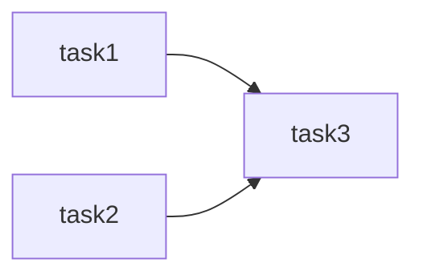

# Avaliação Técnica Gestão Agropecuária e Intergado

A avaliação foi desenvolvida com o Apache Airflow como orquestrador do processo utilizando as bibliotecas Pandas e Numpy para o ETL. Utilizei a interface Astro CLI da Astronomer para executar o Airflow com Docker Containers.

# Instalação do Astro CLI

Para utilizar a interface da Astronomer devemos executar alguns passos que mudam dependendo do sistema utilizado, no meu caso irei indicar o passo a passo que realizei utilizando o Linux Ubuntu.

 1. Instalei o **Docker Engine**.
 2. Utilizei o comando: **curl -sSL install.astronomer.io | sudo bash -s**  para realizar a instalacão do Astro CLI
 
Após a instalação é preciso realizar a configuração e inicialização:

 3.  Criar o diretório que nesse projeto é:  
	 >**Airflow Astro CLI**
 
 4.  Dentro do diretório usar o comando:  
	 >**astro dev init**
	 
 5. Organizei a estrutura do projeto.
 6. Iniciei a versão local do meu Airflow com o comando: 
	 >**astro dev start**
	 
 - Esse comando vai subir 3 Docker containers, cada um para um componente do Airflow:
	- Postgres: Metadata Database do Airflow
	- Webserver:  Componente responsável pelo Airflow UI
	- Scheduler: Componente responsável pelo monitoramento e execução das tasks
 - O Airflow UI pode ser acessado pelo endereço **http://localhost:8080/** com o login e a senha **admin**.
 
 Para obter maiores informações sobre a Astronomer e o Astro CLI e como é feito a instalação em outros sistemas operacionais pode-se acessar o link **https://docs.astronomer.io/**
 
 Para reproduzir na sua máquina siga os passos:
 
 - Clone o projeto.   
 - Executar o passo 4. 
 - Enter yes para atualizar o projeto com as configurações iniciais
 - Excluir o arquivo parquet e modificar o csv para a versão antes do upsert
 - E no diretório do arquivo executar o passo 6

 
## Metodologia da Avaliação

Para a avaliação a estrutura do projeto está da seguinte forma:
```shell
.
├── airflow_settings.yaml
├── dags
│   ├── dag_etl.py
│   ├── ETL
│   │   └── etl_function.py
│   └── include
│       ├── boi_gordo_base.csv
│       ├── boi_gordo_base.parquet
│       └── cepea-consulta-20230116155544.xls
├── Dockerfile
├── include
├── packages.txt
├── plugins
├── README.md
├── requirements.txt
└── tests
    └── dags
```
A Dag da atividade foi dividida em três tasks. A primeira faz a leitura e a transformação da planilha **cepea-consulta-20230116155544.xls** e a segunda faz a busca na API dos dados do **Indexador IPCA**. Como essas duas tasks não tem depência essas são execultadas em paralelo e a saída das duas entram como paramêtro na terceira função.


	
A task3 fica responsável pelo relacionamento do resultado das tasks anteriores com o arquivo **boi_gordo_base.csv** atualizando o arquivo e gravando também em formato parquet.

Para fazer a ETL usei a biblioteca Pandas e Numpy. Nessas bibliotecas consigo manipular os dados em diversos formatos como dataframe e json.

Para realizar os cálculos de correção monetária do IPCA acumulado para a base de 12/2022 utilizei a mesma lógica utilizada no serviço web **Calculadora do cidadão** disponibilizado pelo pelo Banco Central nesse  [link](https://www3.bcb.gov.br/CALCIDADAO/publico/exibirFormCorrecaoValores.do?method=exibirFormCorrecaoValores).

O cálculo é realizado da seguinte  forma:

Se quisermos saber quanto acumulou entre um período de meses, precisamos considerar a variação do índice mês a mês e multiplicá-las. Exemplo:

Considerando-se

 - 2022-11-01 IPCA de 0,49 %
 - 2022-12-01 IPCA de 0,62 %
 
Portanto, calcula-le da seguinte forma:

[(1 + i1)(1 + i2) – 1] x 100
= [(1 + 0,0049)(1 + 0,0062) – 1] x 100
= [1,01113038 – 1] x 100
= 0,01113038 x 100
= 1,113038 %

Ou seja,  a variação dos dois meses, o IPCA acumulado será de 1,113038 %.

Esse aculumado é multiplicado ao valor que precisa ser corrigido.
